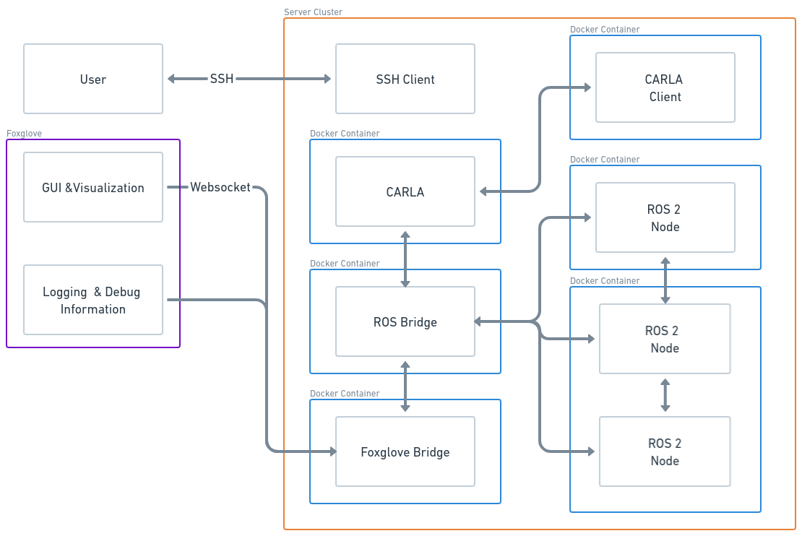

# Documentation 

This file will provide a top level summary of everything you will need to setup this project, along with notes on the components used. 

[1.0 Software & Tools](#sw-tools)

[2.0 Deployment](#deploy) 

[3.0 Development](#develop)

> A presentation with additional information can be referenced here: `./docs/ME599_Project _Presentation.pdf`

<br>

## Workshop

There is a workshop under the `workshop` folder which you can use to familiarize yourself with all the tools and software. 
There is a written guide along with a video you can follow along.

**[Workshop Video](https://youtu.be/a7EO-nI4rdI)**

<br>

# 1.0 Software & Tools <a name="sw-tools"></a>

Below is a summary of all the software and tooling used for this project.

<br>

## 1.1 Docker 

### 1.1.1 Summary 

Docker is a popular platform for developing, packaging, and deploying software applications in a containerized environment. 
A Docker container is a lightweight, standalone executable package that includes all the necessary components, such as libraries,
dependencies, and configuration files, required to run an application. Further, Docker allows developers to create, share, and deploy 
containers easily and consistently across different environments, such as local machines, cloud servers, and data centers. 
It provides benefits such as improved efficiency, portability, and scalability, making it a valuable tool for modern software development and deployment.

The [Getting Started](https://docs.docker.com/get-started/) from Docker provides a good walk-through of how to use Docker.

You may use the Docker CLI or the Docker Desktop application, however for this project the Docker CLI will be used.

The following [Docker Cheatsheet](https://docs.docker.com/get-started/docker_cheatsheet.pdf) provides a great summary of the 
primary docker CLI commands. 

Use can also always type: `docker --help` to get a summary of commands in the CLI. 

### 1.1.2 Setup & Install

**Ensure you have installed Docker**
[Ubuntu Install Guide](https://docs.docker.com/engine/install/ubuntu/)

Import additional steps for ubuntu install: 
[Linux Additional Install Steps](https://docs.docker.com/engine/install/linux-postinstall/)

> A script to install docker & docker compose is available under `utils/docker_linux_install.sh` 

<br>

## 1.2 Docker-compose 

### 1.2.1 Summary

Docker Compose is a tool that enables developers to define and run multi-container Docker applications in a declarative manner. 
Compose allows users to describe their application as a set of services, each of which is defined in a separate Dockerfile. 
Services can be linked together and configured via a Compose file, which specifies the containers, networks, and volumes required to run the application.

The following section [Use Docker Compose](https://docs.docker.com/get-started/08_using_compose/) in the getting started guide provides a overview of Docker Compose.

The following [Docker Compose Cheatsheet](https://devhints.io/docker-compose) provides a good summary. 

Use can also always type: `docker-compose --help` to get a summary of commands in the CLI. 

### 1.2.2 Setup & Install

**Ensure you have installed Docker Compose**
[Docker Compose Install Guide](https://www.digitalocean.com/community/tutorials/how-to-install-and-use-docker-compose-on-ubuntu-22-04)

> A script to install docker & docker compose is available under `utils/docker_linux_install.sh` 

**Note**: A quick note, when running docker-compose, if you run the standard command `docker-compose up` this will run all the containers
in the terminal, you will be able to see all the logs from each one. Typically, running in detached mode by specifying the `-d` flag is preferable
as this runs all the containers in the background, you can see them running with `docker ps`. 

<br>

## 1.3 ROS

### 1.3.1 Summary

ROS, which stands for Robot Operating System, is an open-source framework for building and programming robots. 
It provides a set of libraries and tools that facilitate the development of complex robotics applications, 
including communication between software modules, control of hardware components, and integration of sensors and actuators.

In particular, ROS 2 will be utilized (it will be refered to as ROS, however note that this guide focuses on ROS 2);
a list of the available [Distributions](https://docs.ros.org/en/rolling/Releases.html). 
In general, the Foxy and Galactic will be the best choice as they are relatively recent but have had some time for support by 3rd parties. 
Overall, they should be pretty interchangable but that will need to be evaluated on a case by case basis. 

For any ROS inqueries, the [Tutorials](https://docs.ros.org/en/foxy/Tutorials.html) are pretty helpful. For this project you 
don't need to install ROS locally. 

### 1.3.2 Running ROS using Docker

You can experiment using ROS by simiply pull a docker container of a specific distribution and then run a shell within the container
to run ROS exampes. You can also use the available docker containers as a base and then docker your own custom image with the specific 
packages and configurations you desire, see `./docker/ros2_container/Dockerfile` as an example.

**Pull and Run ROS in a Docker Container**

Pull a container for the appropiate distribution: [Containers](https://hub.docker.com/r/osrf/ros/tags?page=1)
```
docker pull osrf/ros:foxy-desktop-focal
```

Run container: 
```
docker run -it <image-id>
```

Once inside you can run regular ROS 2 commands:
```
ros2 topic list
ros2 pkg list
```

Run demo nodes:
```
ros2 run demo_nodes_cpp listener & ros2 run demo_nodes_cpp talker
```

**Run ROS using Docker Compose**

Docker-compose demo:
```
docker-compose --file ros2_nodes_demo.yaml up
```

<br>

## 1.4 CARLA 

### 1.4.1 Summary

CARLA is an open-source simulator designed for testing and developing autonomous driving systems. It provides a high-fidelity simulation
environment with realistic urban and suburban scenarios, allowing developers to test various perception, planning, and control 
algorithms under different driving conditions. CARLA simulates the behavior of other traffic participants, such as pedestrians, 
cyclists, and other vehicles, making it suitable for testing advanced driving assistance systems and autonomous vehicles.

### 1.4.2 Running CARLA using Docker

It is possible to install and run Carla locally, however it is also easy to just use the available docker image. 
You can run a CARLA instance locally using docker-compose, using the example: `./scripts/carla.yaml`, by running: 

```
docker-compose --file ./scripts/carla.yaml up -d
```

This will create and start a CARLA container with the GUI visible. 

Alternatively, you can also do the following: 

Install CARLA docker container: 
```
docker pull carlasim/carla:latest
```

Launch carla:

```
docker run \
 -p 2000-2002:2000-2002 \
 --cpuset-cpus="0-5" \
 --runtime=nvidia \
 --gpus 'all,"capabilities=graphics,utility,display,video,compute"' \
 -e display=$display \
 -v /tmp/.x11-unix:/tmp/.x11-unix \
 -it \
 carlasim/carla \
 ./carlaue4.sh -vulkan $1
```

To interact with CARLA, to either spawn agents or change the weather you'll need to use the python API. 
You can create a environment locally, and then create the scripts there, such as: 

```
conda env create --name carla python=3.7
conda activate carla
pip install pygame numpy 
```

Or you can create a docker container with a confiured environment, see an example: 
> `./docker/carla_client_node/Dockerfile`

<br>

## 1.5 Foxglove

### 1.5.1 Summary 

Foxglove is an open-source software platform designed to simplify the development of robotic applications. 
Foxglove features a flexible and modular architecture that allows users to create custom workflows using pre-built 
components and libraries. It also includes a web-based user interface that makes it easy to monitor
and control robotic systems in real-time.

In general, foxglove can be used to monitor ROS topics, providing a nice interface to look at messages, debugging information
and also visualize various types of data. It is a useful tool to debug and monitor both locally and from a remote server. 

### 1.5.2 Running Foxglove

There are a couple of different methods for installing and running foxglove: 
1. Web App
2. Desktop App
3. Docker Container 

Any method should work, although for this project we will focus on using the docker container. 

There are 2 components to Foxglove; the bridge and the studio. The bridge is a application that is 
responsible for collecting all the ROS topics and info and then streaming it using a websocket. The studio is the interface
you use to view all this information. The bridge will run along your ROS nodes and the Studio can run locally or remotely from
another client. 

An example of a foxglove bridge can be found under `./scripts/foxglove_bridge.yaml`, and a studio docker-compose example can be found
under `./scripts/foxglove.yaml`. 

<br>

## 1.6 Linux & Other

### 1.6.1 Linux

In general, it is recommeneded to develop using Linux - for instance ROS is only supported on Linux, Docker and other applications work better
and tend to be easier to work with on Linux. At minimun, if you are using the Wato Server Cluster you will need to use Linux once SSH'd into the 
server. Therefore, if you are not well too familar with Linux, it is recommended to learn a bit: [Linux Getting Started](https://www.digitalocean.com/community/tutorial_series/getting-started-with-linux)

### 1.6.2 Nvidia GPU

Here are some resources for using a Nvidia GPU on linux systems (you may or may not need to configure this if running locally). 

Check [Nvidia Drivers Versions](https://xcat-docs.readthedocs.io/en/stable/advanced/gpu/nvidia/verify_cuda_install.html)

```
nvidia-smi
```

Check [CUDA](https://developer.nvidia.com/cuda-downloads) Driver 

```
/usr/local/cuda/bin/nvcc --version
```

Nvidia Container Toolkit: https://docs.nvidia.com/datacenter/cloud-native/container-toolkit/install-guide.html#installation-guide

CUDA Samples: https://github.com/NVIDIA/cuda-samples 

<br>

## 1.7 Watonomous <a name="wato"></a>

As part of UWAFT, you can gain access and utilize the Watonomous server cluster to running applications on it. To do this you'll need to 
gain access to the Servers, become a Wato Team Member. Then, it is recommeneded to join the discord as well and connect in the `#simulation`
channels. 

### 1.7.1 Server Access

Follow the instructions here to request access: [Wato Server Access](https://status.watonomous.ca/)

Once you've completed all the steps, to make access to the server simpler, it is recommeneded to setup your shh config as follows: 

Under `~/.ssh/config`:
**Note**: This is log you into the same server each time, based on which server is listed for `HostName`. 

```
# WATO Server Config
# Uses and SSH Jump
Host bastion
  HostName bastion.watonomous.ca
  User <username> 
  IdentityFile /home/<user>/.ssh/id_ed25519 

Host wato-server 
  ProxyJump bastion
  User <username> 
  HostName trpro-ubuntu1.watocluster.local
  ForwardAgent yes
```

Once you have this setup, you can ssh using one command: 

```
ssh wato-server
```

Additionally, see if you can get access to the current Watonomous Monorepo as it can be a good source of reference and information. It
is encouraged to collaborate with Watonomous as they are building similar simulation systems. 

Here is a paper on Software Simuation: [Wato Software Simulation Stack](https://rowandempster.github.io/portfolio/sw)

<br>

# 2.0 Deployment <a name="deploy"></a>

Below is an overview of the project and how to deploy it either locally or on the Wato server cluster.

<br>

## 2.1 Project Structure

The project is organized as follows. The `./docs` folder contains additional documentation and resources, and `./utils` has some additional 
scripts for auxillary functions. The `./scripts` folder contains docker-compose files to run indvidual containers such as a standalone CARLA server, 
foxglove bridge and studio. Under the `./docker` folder as different docker files to create each image:

* `carla_client_node`: Is a container configred to connect to a running carla container and interface with it, current it simulates Lidar and Camera data. 
* `foxglove_bridge`: This is a container that builds a foxglove bridge. 
* `ros2_container`: This is a container with ROS2 installed and configured in it, currently is runs a node that simply prints all available ROS topics. There is 
a sample ROS 2 workspace, from which the ROS node is copied. This container serves as an example of how to create a standalone docker container for a ROS 2 / set
of nodes within a workspace.

At the top level of the project is the `docker-compose.yaml` file which launches everything with one command.

```
./
├── docker
│   ├── carla_client_node
│   ├── foxglove_bridge
│   ├── ros2_container
│   │   └── ros2_ws
│   │       ├── build
│   │       ├── install
│   │       ├── log
│   │       └── src
│   └── ros_carla_bridge
├── docs
├── scripts
├── utils
└── workshop
    ├── app
    └── server
```

<br>

## 2.2 Architecture

Below is a diagram of the high level architecture of the project, depicted deployed to a server with a remote host connected. 
You can also simply deploy and run everything locally. 



<br>

## 2.3 Deploy Locally

To deploy locally, simply run: `docker-compose up`. This will run in the current terminal so you will be able to see
all the logs from each container displayed - you can shut everything down from here by hitting `Ctrl+C`. You can also
run in detached mode which deploys all services in the background by running `docker-compose up -d` - then you can shut
everything down by running `docker-compose down`. 

**Note:** The first time you run this it may take a while
since there are quite a few large images that need to be build and downloaded - ensure you have ~30GB of free space
to be safe. 

You can see all the services running with (the formatting options makes the display a little more concise):
```
docker ps --format "table {{.ID}}\t{{.Names}}\t{{.Ports}}\t{{.Size}}" 
```

```
CONTAINER ID   NAMES                                        PORTS                                                           SIZE
65b1fb1779a2   carla_client                                                                                                 0B (virtual 3.59GB)
51fafa88e077   ros2_container                                                                                               935kB (virtual 3.12GB)
09b781ba2fa3   foxglove_bridge                              0.0.0.0:8765->8765/tcp, :::8765->8765/tcp                       426kB (virtual 3.62GB)
14027b0e82c0   carla_ros_bridge                                                                                             6.43MB (virtual 3.53GB)
016613c34d83   sample_docker_carla_project_ros_listener_1                                                                   28.7kB (virtual 3.93GB)
b2b53e5d6c87   carla_server                                 0.0.0.0:2000-2002->2000-2002/tcp, :::2000-2002->2000-2002/tcp   109MB (virtual 16.7GB)
2cf37dc9b694   sample_docker_carla_project_ros_talker_1                                                                     28.7kB (virtual 3.93GB)
```

You can see resource consumption for each service by running `docker stats`:

```
CONTAINER ID   NAME                                         CPU %     MEM USAGE / LIMIT     MEM %     NET I/O           BLOCK I/O         PIDS
65b1fb1779a2   carla_client                                 101.50%   9.84MiB / 30.78GiB    0.03%     6.51MB / 123kB    1.46MB / 0B       10
51fafa88e077   ros2_container                               5.02%     39.26MiB / 30.78GiB   0.12%     578kB / 276kB     1.34MB / 893kB    11
09b781ba2fa3   foxglove_bridge                              0.05%     54.55MiB / 30.78GiB   0.17%     598kB / 506kB     43.6MB / 672kB    28
14027b0e82c0   carla_ros_bridge                             59.82%    255.6MiB / 30.78GiB   0.81%     1.05GB / 2.85MB   41.4MB / 4.57MB   51
016613c34d83   sample_docker_carla_project_ros_listener_1   0.08%     24.07MiB / 30.78GiB   0.08%     638kB / 378kB     5.3MB / 8.19kB    12
b2b53e5d6c87   carla_server                                 90.55%    2.07GiB / 30.78GiB    6.73%     2.19MB / 1.05GB   2.64GB / 109MB    57
2cf37dc9b694   sample_docker_carla_project_ros_talker_1     0.10%     32.66MiB / 30.78GiB   0.10%     617kB / 373kB     25.3MB / 8.19kB   12
```

After running everything locally, you can start the foxglove studio service to view all topics and data by running: 

```
cd ./scripts
docker-compose --file foxglove.yaml up 
```

Then navigate to `localhost:8080` on a webrowser, there open a Foxglove websocket connection to `ws://localhost:8765`. 
Now you should see live ROS topics and information being displayed. 

<br>

## 2.4 Deploy on the Wato Server

First, SSH into the Wato Server cluster, if you setup the SSH config as described above in [1.7 Wato Server Access](#wato) 

```
ssh wato-server
```

Then, once in the server you can deploy normally as before using `docker-compose up`. 

To connect Foxglove to a remote instance you'll need to open a new terminal, then run: 

```
ssh -L 5900:localhost:8765 wato-server
```

Ensure you have launched a foxglove instance: 

```
cd ./scripts
docker-compose --file foxglove.yaml up 
```

Then navigate to `localhost:8080` on a webrowser, there open a Foxglove websocket connection to `ws://localhost:5900`. 

<br>

## 2.5 Troubleshooting

If you run into some errors, trying running `docker-compose` with the `--remove-orphans` and/or `--force-recreate` flags. If
errors persist, try re-building everything by running the `--build` flag. 

<br>

## 2.6 Maintainance

A method to stop all containers: 

```
docker stop $(docker ps -aq)
```

A method to remove all containers: 

```
docker rm $(docker ps -aq)
```

<br>

# 3.0 Development <a name="develop"></a>

Below are some notes for further development of this project.

<br>

## 3.1 Known Bugs and Errors

### 3.1.1 CARLA ROS Bridge Initial Connection

Github Issue: [673](https://github.com/carla-simulator/ros-bridge/issues/673)

Title: CARLA ROS Bridge Docker Container having issues initially connecting to CARLA Server running in a Docker Container

CARLA version: 0.9.13

Platform/OS: Docker/Linux

I am using docker compose to launch Carla and a Carla ROS Bridge instance, here is my docker compose file: 

```
version: '3.8'

services:

  # Carla server container
  carla:
    image: carlasim/carla:0.9.13
    container_name: carla_server
    runtime: nvidia
    ports:
      - 2000-2002:2000-2002
    command: /bin/bash -c "./CarlaUE4.sh -nosound -carla-server -RenderOffscreen -world-port=2000"

  # Carla ROS bridge container
  bridge:
    build:
      context: ./docker/ros_carla_bridge/
      dockerfile: Dockerfile
    container_name: carla_ros_bridge
    command: ros2 launch carla_ros_bridge carla_ros_bridge_with_example_ego_vehicle.launch.py host:=carla_server timeout:=5
    runtime: nvidia
    restart: always
    depends_on: 
      carla:
        condition: service_started
```

And here is my ROS Bridge docker file: 

```
FROM osrf/ros:foxy-desktop-focal AS base

SHELL ["/bin/bash", "-c"]

RUN apt update && apt install -y python3-pip

RUN sudo apt install python3-colcon-common-extensions

RUN mkdir -p ~/carla-ros-bridge
WORKDIR /root/carla-ros-bridge

RUN git clone --recurse-submodules https://github.com/carla-simulator/ros-bridge.git src/ros-bridge

RUN rosdep update && rosdep install --from-paths src --ignore-src -r

RUN source /opt/ros/foxy/setup.bash && \
    colcon build

COPY ros_entrypoint.sh /

# Ensure script is executable
RUN ["sudo", "chmod", "+x", "/ros_entrypoint.sh"]

ENTRYPOINT ["/ros_entrypoint.sh"]

RUN python3 -m pip install --upgrade pip && python3 -m pip install numpy pygame
RUN python3 -m pip install 'carla==0.9.13'

```

I found when I run `docker-compose up` the carla_ros_bridge has trouble connecting to the carla server, the container crashes then restarts and then its able to connect, here is the error: 

```
carla_ros_bridge   | [bridge-1] [ERROR] [1680446255.811228168] [carla_ros_bridge]: Error: time-out of 5000ms while waiting for the simulator, make sure the simulator is ready and connected to carla_server:2000
carla_ros_bridge   | [bridge-1] [INFO] [1680446255.811739344] [carla_ros_bridge]: Shutting down...
```

Then on the second retry it is able to connect. 

I was wondering why it might be failing to connect on the first try, any ideas? 

Thanks

Note: I am not sure if this is a Carla issue or a ROS bridge issue, I've also created a issue in Carla for this: https://github.com/carla-simulator/carla/issues/6373 

